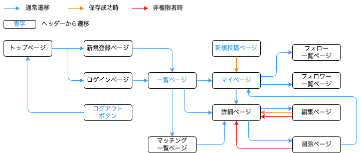

>後に削除
## usersテーブル

| Column             | Type    | Options                   |
| ------------------ | ------- | ------------------------- |
| email              | string  | null: false, unique: true |
| encrypted_password | string  | null: false               |
| nickname           | string  | null: false               |
| word               |  text   |                           |

### Association

- has_many :tags, through: :user_tags
- has_many :items
- has_many :favorites

## tags テーブル

| Column | Type   | Options     |
| ------ | ------ | ----------- |
| name   | string | null: false |

### Association

- has_many :users, through: :user_tags

## user_tags テーブル

| Column | Type       | Options                       |
| ------ | ---------- | ----------------------------- |
| user   | references | null: false,foreign_key: true |
| tag    | references | null: false,foreign_key: true |

### Association

- belongs_to :user
- belongs_to :tag

## items テーブル

| Column           | Type       | Options                       |
| ---------------- | ---------- | ----------------------------- |
| category_id      |  integer   | null: false                   |
| sales_name       |   string   | null: false                   |
| price            |  integer   |                               |
| evaluation_id    |  integer   | null: false                   |
| comment_title    |   string   | null: false                   |
| comment_detail   |    text    |                               |
| user             | references | null: false,foreign_key: true |

### Association

- belongs_to :user

## favorites テーブル

| Column | Type       | Options                       |
| ------ | ---------- | ----------------------------- |
| user   | references | null: false,foreign_key: true |

### Association

- belongs_to :user
***

# アプリケーション名
Fit Skin

# アプリケーション概要
これまで自身が使用してきた商品のレビューから、似たレビューの人同士をマッチングさせることで、自身に合う新たな商品を見つけることができる。

# URL

# テスト用アカウント

# 利用方法

# アプリケーションを作成した背景

# 洗い出した要件
[要件を定義したシート](https://docs.google.com/spreadsheets/d/1LLWfr6ZU8rBb5ePfhpQeXhkq4owPEU3uZ4ZpiHwV7m4/edit#gid=982722306)

# 実装した機能についての画像やGIFおよびその説明

# 実装予定の機能

# データベース設計

# 画面遷移図

# 開発環境
Ruby on Rails

# ローカルでの動作方法

# 工夫したポイント