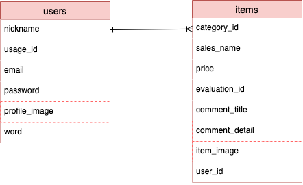

# アプリケーション名
Fit Skin

# アプリケーション概要
これまで自身が使用してきた商品のレビューから、似たレビューの人同士をマッチングさせることで、自身に合う新たな商品を見つけることができる。

# URL

# テスト用アカウント

# 利用方法
[1]トップページから新規登録を行い、アカウントを作成する
（アカウント情報を編集したい場合は右上のアイコンからマイページへ遷移し、アカウント情報の下にある編集ボタンからアカウント編集ページへ移動することができる）
[2]右上のアイコンから新規投稿を行う

# アプリケーションを作成した背景
自分自身アトピー肌で、商品が肌に合わず損した経験が何度もあります。そこで、同じ肌質の人から商品の感想をきければ、肌に合う商品に出会える可能性が上がると考え、このアプリケーションを作成することにしました。

# 洗い出した要件
[要件を定義したシート](https://docs.google.com/spreadsheets/d/1LLWfr6ZU8rBb5ePfhpQeXhkq4owPEU3uZ4ZpiHwV7m4/edit#gid=982722306)

# 実装した機能についての画像やGIFおよびその説明
- ユーザー管理機能
- 商品投稿機能
- マイページ機能
- 一覧機能

# 実装予定の機能
- 投稿商品編集機能
- 投稿商品削除機能
- 検索機能
- お気に入り登録機能

# データベース設計

# 画面遷移図

# 開発環境
[使用言語]
HTML, CSS, JavaScript, Ruby on Rails

# ローカルでの動作方法

# 工夫したポイント
フロント実装において、javascriptを利用した動きのあるビューを作成しました。
デザインも統一しており、「使いたくなる」「使いやすい」を意識して作成しました。